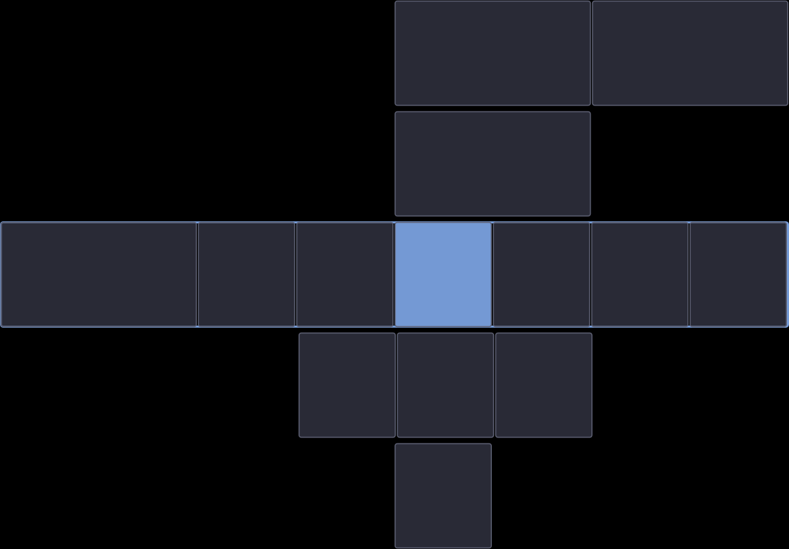

# nirimap

[](https://github.com/alexandergknoll/nirimap/actions/workflows/ci.yml)

Una superposición de minimapa minimalista para los espacios de trabajo del compositor Wayland [Niri](https://github.com/YaLTeR/niri).



## Características

- Muestra un minimapa de tus espacios de trabajo mostrando la disposición de las ventanas
- Dos modos de visualización: mostrar todos los espacios de trabajo apilados verticalmente (estilo Vista general) o solo el activo
- Se renderiza como una superficie de capa superpuesta (visible sobre ventanas en pantalla completa)
- Diseño atravesable con clic (no intercepciona eventos del ratón)
- Apariencia configurable (colores, bordes, espacios, opacidad)
- Comportamiento de visibilidad configurable (siempre visible o mostrar al ocurrir eventos)
- Recarga en caliente los cambios de configuración
- Tamaño dinámico basado en el contenido del espacio de trabajo

## Instalación

### Arch Linux (AUR)

Hay disponible un paquete AUR mantenido por la comunidad: [`nirimap-git`](https://aur.archlinux.org/packages/nirimap-git). Se compila desde el último commit y es seguido por pacman.

```bash
# Usando un ayudante de AUR (p. ej., paru, yay)
paru -S nirimap-git
```

> **Nota**: El paquete AUR es mantenido por un miembro de la comunidad, no por el desarrollador de este proyecto. Por favor, dirige los problemas de empaquetado al mantenedor del paquete AUR.

### Desde el código fuente

Requiere Rust 1.75+ y las bibliotecas de desarrollo de GTK4.

```bash
# Instalar dependencias (Arch Linux)
sudo pacman -S gtk4 gtk4-layer-shell

# Instalar dependencias (Fedora)
sudo dnf install gtk4-devel gtk4-layer-shell-devel

# Instalar dependencias (Ubuntu/Debian)
sudo apt install libgtk-4-dev libgtk4-layer-shell-dev

# Compilar e instalar
cargo install --path .

# Compilar para release
cargo build --release
```

## Uso

Ejecuta `nirimap` después de iniciar Niri. Para el inicio automático, añade lo siguiente a tu configuración de Niri:

```kdl
spawn-at-startup "nirimap"
```

### Reglas de Capa de Niri

Puedes añadir reglas de capa para personalizar la apariencia del minimapa:

```kdl
layer-rule {
    match namespace="nirimap"
    // Añade aquí cualquier regla específica de capa, como la opacidad
}
```

## Configuración

El archivo de configuración se encuentra en `~/.config/nirimap/config.toml`. Se crea una configuración predeterminada en la primera ejecución.

```toml
[display]
height = 100                # Altura de fila por espacio de trabajo en píxeles
                            # modo "current": altura total del widget
                            # modo "all": altura de una sola fila de espacio de trabajo
max_width_percent = 0.5     # Ancho máximo como fracción de la pantalla (0.0 - 1.0)
max_height_percent = 0.8    # Altura máxima como fracción de la pantalla (modo "all")
anchor = "top-right"        # Posición: top-left, top-center, top-right,
                            #           bottom-left, bottom-center, bottom-right, center
margin_x = 10               # Margen horizontal desde el borde
margin_y = 10               # Margen vertical desde el borde
workspace_mode = "all"      # "all"     - apila todos los espacios de trabajo verticalmente (predeterminado)
                            # "current" - muestra solo el espacio de trabajo activo

[appearance]
background = "#1e1e2e"    # Color de fondo (hex)
window_color = "#45475a"  # Color predeterminado del rectángulo de ventana
focused_color = "#89b4fa" # Destaque de ventana enfocada
border_color = "#6c7086"  # Color del borde de ventana
border_width = 1            # Grosor del borde de ventana
border_radius = 2           # Radio de esquina para rectángulos de ventana
gap = 2                     # Espacio entre ventanas (en píxeles del minimapa)
background_opacity = 0.0    # Opacidad del fondo (0.0 = transparente, 1.0 = opaco)
                            # Se aplica en ambos modos "current" y "all"
window_opacity = 0.7        # Opacidad de relleno para ventanas sin enfoque (0 = solo contornos)
focused_opacity = 1.0       # Opacidad de relleno para la ventana enfocada
workspace_gap = 4                           # Espacio vertical entre espacios de trabajo apilados (modo "all")
active_workspace_border_color = "#89b4fa"   # Borde de destacado para el espacio de trabajo activo (modo "all")
active_workspace_border_width = 2           # Grosor del borde de destacado (modo "all")

[behavior]
show_on_overview = true        # Mantener visible en el modo Vista general de Niri (aún no implementado)
always_visible = true          # Mostrar siempre el minimapa (false = solo al ocurrir eventos)
hide_timeout_ms = 2000         # Milisegundos antes de ocultarse tras un evento
show_for_floating_windows = false # Mostrar el minimapa para eventos de ventanas flotantes
                                  # (enfoque hacia/desde una ventana flotante, lanzamiento de ventana
                                  # flotante). Desactivado por defecto: las ventanas flotantes no se
                                  # dibujan en el minimapa, por lo que la actividad de ventanas emergentes
                                  # de lo contrario lo haría parpadear encendido/apagado.
```

### Modos de Visualización de Espacios de Trabajo

Dos modos de visualización controlan lo que muestra el minimapa:

- **`all`** (predeterminado) — cada espacio de trabajo se renderiza como una fila, apiladas verticalmente en el orden de espacios de trabajo de Niri (como la función Vista general de Niri). El espacio de trabajo activo se destaca con un borde para que puedas ver de un vistazo dónde está el enfoque.
- **`current`** — solo se renderiza el espacio de trabajo activo. La altura del widget es igual a `display.height` y el contenido del minimapa cambia al cambiar de espacio de trabajo. Este es el comportamiento clásico de nirimap.

En el modo `all`, la altura total del widget crece con el número de espacios de trabajo, limitada a `max_height_percent` de la altura del monitor. Cuando se alcanza el límite, las filas por espacio de trabajo se reducen proporcionalmente para ajustarse.

### Recarga en Caliente

El archivo de configuración se monitoriza para detectar cambios. La mayoría de los ajustes se aplicarán inmediatamente sin reiniciar:

- Ajustes de apariencia (colores, bordes, espacios, opacidad)
- Ajustes de comportamiento (visibilidad, tiempo de espera)
- Ajustes de visualización (altura, ancho máximo)

**Nota**: Cambiar `anchor` o los márgenes requiere reiniciar nirimap.

### Comportamiento de Visibilidad

Cuando `always_visible = false`, el minimapa se mostrará temporalmente cuando:

- Se abra una nueva ventana
- Cambie el enfoque de ventana (a otra ventana)
- Se cambie de espacio de trabajo
- Cambie la disposición de las ventanas (redimensionar, mover entre columnas)

El minimapa se oculta automáticamente después de `hide_timeout_ms` milisegundos.

Por defecto, el minimapa permanece oculto para la actividad de ventanas flotantes:

- El enfoque se mueve **a** una ventana flotante (ventana emergente, diálogo, selector de archivos)
- El enfoque regresa **desde** una ventana flotante a la ventana en mosaico previamente enfocada
- Se genera una nueva ventana flotante

Las ventanas flotantes no se dibujan en el minimapa, por lo que esta actividad
de lo contrario causaría un parpadeo distractor de encendido/apagado. Establece
`show_for_floating_windows = true` para restaurar el comportamiento anterior.

## Limitaciones Conocidas

### Soporte para Múltiples Monitores

Actualmente, nirimap solo rastrea y muestra ventanas en un solo monitor. Las configuraciones con múltiples monitores pueden provocar que las ventanas no aparezcan en el minimapa o que el rastreo de espacios de trabajo sea incorrecto. Se planea el soporte completo para múltiples monitores.

Consulta [Issue #21](https://github.com/alexandergknoll/nirimap/issues/21) para más detalles.

### Ventanas Flotantes

Actualmente, las ventanas flotantes no se muestran en el minimapa. Esto se debe a una limitación en la API de IPC de Niri, que no expone la información de posición de desplazamiento del viewport necesaria para calcular con precisión las posiciones de las ventanas flotantes en el minimapa.

**Detalles técnicos**: Tanto las ventanas en mosaico como las flotantes informan coordenadas relativas al viewport, pero el desplazamiento del viewport no se puede determinar de manera confiable a partir de los datos de IPC disponibles. Si bien podemos estimar el desplazamiento del viewport basándonos en la columna enfocada, esto falla cuando las ventanas flotantes tienen el enfoque o cuando el viewport se desplaza sin cambios de enfoque (p. ej., operaciones de "columna central").

Consulta [Issue #6](https://github.com/alexandergknoll/nirimap/issues/6) para más detalles y posibles soluciones futuras.

## Dependencias

- [niri-ipc](https://crates.io/crates/niri-ipc) - Protocolo IPC de Niri
- [gtk4](https://crates.io/crates/gtk4) - Bindings de GTK4
- [gtk4-layer-shell](https://crates.io/crates/gtk4-layer-shell) - Protocolo layer shell de Wayland

## Licencia

Licencia MIT - consulta [LICENSE](LICENSE) para más detalles.

## Contribución

¡Se aceptan issues y pull requests! Este proyecto se desarrolló con la ayuda de herramientas asistidas por IA (Claude Code). Revisa los cambios cuidadosamente y no dudes en señalar cualquier cosa que parezca incorrecta.
